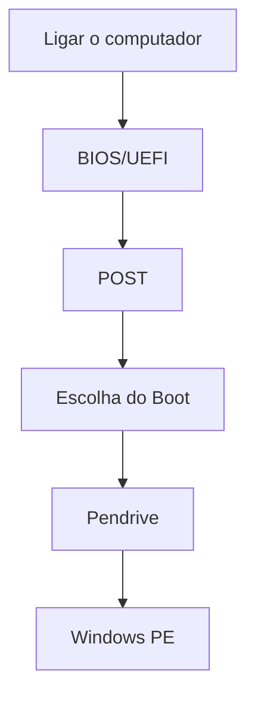
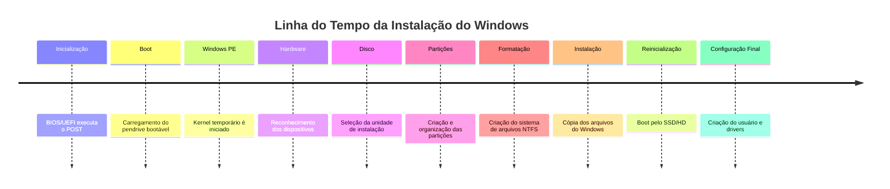

# 🖥️ Atividade – Formatação e Instalação de um Sistema Operacional Windows


# 📝 Introdução

A instalação do Windows é um processo que envolve diversas etapas, desde a inicialização do computador até a configuração final do sistema operacional. Durante esse processo, diferentes componentes do Sistema Operacional trabalham em conjunto para reconhecer o hardware, organizar o armazenamento, gerenciar memória, controlar processos e permitir a comunicação entre software e hardware.

Neste trabalho será apresentada uma descrição completa da formatação e instalação do Windows, relacionando cada etapa aos conceitos estudados na disciplina de Sistemas Operacionais.

---

# 🎯 Objetivo

Este trabalho tem como objetivo compreender como ocorre o processo de formatação e instalação do Windows e identificar onde os principais conceitos da arquitetura de Sistemas Operacionais estão presentes durante esse procedimento.

---

# 🖼️ Ilustração Geral

> **Figura 1 – Processo de instalação do Windows**


---

# 🚀 Descrição do Processo

## 1. Inicialização do Computador (Boot)

Quando o computador é ligado, o firmware **BIOS/UEFI** executa o **POST (Power-On Self-Test)** para verificar se os principais componentes de hardware estão funcionando corretamente.

Após essa verificação, a BIOS/UEFI procura um dispositivo inicializável conforme a ordem de boot configurada. Neste trabalho, considera-se um pendrive bootável contendo o instalador do Windows.

### Componentes envolvidos

- BIOS/UEFI
- Processador
- Memória RAM
- SSD/HD
- Pendrive

### Recursos utilizados

| Recurso | Função |
|---------|--------|
| CPU | Executa as instruções da BIOS |
| RAM | Armazena temporariamente informações |
| Pendrive | Contém o instalador |
| SSD | Destino da instalação |

> **Figura 2 – Fluxo do Boot**


# 🚀 Descrição do Processo de Formatação e Instalação do Windows

## 1️⃣ Inicialização do Computador (Boot)


O processo começa quando o usuário pressiona o botão **Power** do computador. Nesse momento, a fonte de alimentação fornece energia para todos os componentes da máquina e o firmware da placa-mãe (**BIOS** ou **UEFI**) assume o controle.

A primeira tarefa realizada é o **POST (Power-On Self-Test)**, responsável por verificar se os principais componentes do computador estão funcionando corretamente.

Durante essa etapa são verificados:

- Processador (CPU)
- Memória RAM
- Placa de vídeo
- Teclado
- Mouse
- SSD ou HD
- Outros dispositivos conectados

Caso algum componente apresente falha, o computador poderá emitir sinais sonoros (beeps) ou exibir mensagens de erro antes mesmo de iniciar qualquer Sistema Operacional.

### Recursos utilizados

| Recurso | Função |
|----------|--------|
| CPU | Executa as instruções do firmware |
| RAM | Armazena informações temporárias durante o POST |
| BIOS/UEFI | Inicializa o hardware |
| SSD/HD | Será utilizado posteriormente para carregar o sistema |
| Pendrive | Contém o instalador do Windows |

> 💡 **Importante:** Até esse momento ainda não existe nenhum Sistema Operacional sendo executado.

---

## 2️⃣ Escolha do Dispositivo de Boot


Depois que todos os testes terminam, a BIOS/UEFI procura um dispositivo capaz de iniciar um sistema operacional.

A ordem normalmente é definida nas configurações da placa-mãe.

Exemplo:

| Ordem | Dispositivo |
|-------|-------------|
| 1 | Pendrive |
| 2 | SSD |
| 3 | HD |
| 4 | DVD |

Como o objetivo é instalar o Windows, normalmente é utilizado um **pendrive bootável** criado com a ferramenta oficial da Microsoft.

Quando encontrado, o instalador do Windows começa a ser carregado para a memória RAM.

---

## 3️⃣ Carregamento do Instalador


Agora o ambiente de instalação do Windows é executado.

Embora pareça o Windows normal, na verdade trata-se de um pequeno sistema operacional temporário chamado **Windows PE (Preinstallation Environment)**.

Durante essa etapa são carregados:

- Kernel temporário
- Interface gráfica
- Drivers básicos
- Sistema de arquivos temporário
- Serviços essenciais

Esses componentes permitem que o computador funcione mesmo antes do Windows definitivo estar instalado.

---

## Fluxo Simplificado da Inicialização



---

## 4️⃣ Escolha das Configurações

Após carregar o instalador, o usuário define algumas configurações iniciais.

Entre elas:

- Idioma
- Formato de hora
- Região
- Layout do teclado

Exemplo:

| Configuração | Valor |
|--------------|-------|
| Idioma | Português (Brasil) |
| Formato | Português (Brasil) |
| Teclado | ABNT2 |

Essas configurações serão utilizadas pelo Sistema Operacional após a instalação.

---

## 5️⃣ Seleção da Unidade de Armazenamento


Nesta etapa o instalador procura todos os dispositivos de armazenamento conectados.

Exemplo:

| Disco | Tipo |
|--------|------|
| Disco 0 | SSD NVMe |
| Disco 1 | HD SATA |
| Disco 2 | SSD SATA |

O usuário escolhe em qual unidade deseja instalar o Windows.

Se existirem dados importantes, eles devem ser copiados antes da formatação.

---

## 6️⃣ Particionamento

Uma unidade física pode ser dividida em diversas **partições**.

Cada partição funciona como um disco independente.

Exemplo:

| Partição | Finalidade |
|-----------|------------|
| EFI | Inicialização do Windows |
| MSR | Reservada pelo sistema |
| Primária | Arquivos do Windows |
| Recuperação | Ferramentas de recuperação |

### Diferença entre Particionar, Formatar e Apagar Dados

| Operação | Descrição |
|----------|-----------|
| Apagar Dados | Remove arquivos existentes |
| Particionar | Divide o disco em áreas independentes |
| Formatar | Cria um novo sistema de arquivos |

Esses três conceitos costumam ser confundidos, mas representam operações completamente diferentes.

---

## 7️⃣ Formatação


Depois que a partição é escolhida, o instalador cria um novo sistema de arquivos.

O Windows utiliza normalmente o **NTFS (New Technology File System)**.

Durante a formatação ocorre:

- criação da MFT (Master File Table);
- organização dos diretórios;
- criação das estruturas de armazenamento;
- preparação para gravação dos arquivos.

Os dados antigos deixam de fazer parte da nova estrutura do sistema de arquivos.

---

## 8️⃣ Cópia dos Arquivos

Nesta etapa milhares de arquivos são copiados para o SSD.

Entre eles:

- Kernel
- Drivers
- DLLs
- Registro do Windows
- Interface gráfica
- Serviços
- Ferramentas administrativas

Essa é uma das etapas que mais utiliza:

- CPU
- RAM
- SSD
- Controlador SATA/NVMe

---

## Fluxograma da Instalação


---

## 9️⃣ Reinicialização

Depois da cópia dos arquivos, o computador reinicia automaticamente.

Agora a BIOS/UEFI não inicializa mais pelo pendrive.

Ela encontra o **Windows Boot Manager**, instalado no SSD, responsável por localizar o Kernel do Windows.

O Kernel é carregado para a memória RAM e passa a controlar todo o computador.

---

## 🔟 Primeira Inicialização

Na primeira execução do Windows ocorre a configuração automática do sistema.

São realizados:

- reconhecimento do hardware;
- criação do usuário;
- configuração da rede;
- instalação automática de drivers;
- criação das pastas do usuário;
- preparação da área de trabalho.

Quando todas essas etapas terminam, o Windows está pronto para uso.

---

# ✅ Resumo Geral

| Etapa | Principal objetivo |
|--------|--------------------|
| Boot | Inicializar o hardware |
| Windows PE | Executar o instalador |
| Escolha do Disco | Definir onde instalar |
| Particionamento | Organizar o armazenamento |
| Formatação | Criar o sistema de arquivos |
| Cópia | Instalar os arquivos |
| Reinicialização | Inicializar o Windows |
| Configuração Final | Preparar o ambiente para o usuário |

---

---

# 🧩 Componentes do Sistema Operacional


Os componentes do Sistema Operacional trabalham em conjunto para controlar os recursos do computador e permitir que o Windows seja instalado corretamente.

Durante a instalação, cada componente possui uma função específica.

## Principais componentes

| Componente | Função | Momento em que é utilizado |
|------------|---------|----------------------------|
| Kernel | Gerencia todos os recursos do computador | Durante toda a instalação e execução do Windows |
| Gerenciador de Processos | Controla os programas em execução | Desde o carregamento do instalador |
| Gerenciador de Memória | Distribui e libera memória RAM | Durante toda a instalação |
| Sistema de Arquivos | Organiza os dados gravados no SSD/HD | Durante a formatação e cópia dos arquivos |
| Drivers | Fazem a comunicação com o hardware | Antes, durante e após a instalação |
| Gerenciador de Entrada e Saída (I/O) | Controla a comunicação com dispositivos | Durante todo o processo |

## Recursos que precisam ser gerenciados

Durante a instalação do Windows, o Sistema Operacional precisa controlar diversos recursos.

- Processador (CPU)
- Memória RAM
- SSD ou HD
- Pendrive de instalação
- Placa de vídeo
- Teclado
- Mouse
- Monitor
- Rede
- Áudio

Todos esses recursos são administrados automaticamente pelo Sistema Operacional, evitando conflitos entre programas.

> **Observação:** Sem esse gerenciamento, dois programas poderiam tentar utilizar o mesmo recurso ao mesmo tempo, causando erros ou travamentos.

---

# 🧠 Kernel – O Núcleo do Sistema


O **Kernel** é o componente mais importante do Sistema Operacional.

Ele funciona como uma ponte entre os programas e o hardware.

## Quando o Kernel começa a atuar?

Durante a instalação do Windows é utilizado inicialmente um **Kernel temporário**, pertencente ao ambiente **Windows PE (Preinstallation Environment)**.

Depois que a instalação termina, o computador passa a utilizar o Kernel definitivo do Windows instalado no SSD.

## Funções do Kernel

- Controlar a CPU;
- Gerenciar a memória RAM;
- Controlar dispositivos de entrada e saída;
- Carregar drivers;
- Gerenciar processos;
- Controlar o acesso ao hardware;
- Garantir segurança entre programas.

## Comunicação entre software e hardware

Quando um programa precisa acessar um dispositivo, ele não conversa diretamente com o hardware.

O caminho é o seguinte:

```text
Programa
      ↓
Kernel
      ↓
Driver
      ↓
Hardware
```

Esse modelo aumenta a segurança e evita que programas causem danos ao computador.

---

# 🔐 Modos de Execução

O processador trabalha em dois modos principais.

## Modo Usuário (User Mode)

Neste modo executam:

- Navegadores
- Jogos
- Editores de texto
- Instalador do Windows (interface gráfica)

Nesse modo os programas possuem acesso limitado aos recursos do computador.

Eles não podem modificar diretamente:

- Memória do Kernel;
- Processador;
- Disco;
- Drivers.

Caso precisem acessar algum recurso, fazem uma solicitação ao Kernel.

---

## Modo Kernel (Kernel Mode)

Neste modo executam:

- Kernel;
- Drivers;
- Gerenciador de memória;
- Gerenciador de processos.

Nesse modo existe acesso completo ao hardware.

Por isso, qualquer erro nessa área pode causar a famosa **Tela Azul da Morte (Blue Screen of Death - BSOD)**.

---

## Comparação

| Característica | Modo Usuário | Modo Kernel |
|----------------|-------------|-------------|
| Acesso ao hardware | Não | Sim |
| Segurança | Alta | Total controle |
| Executa aplicativos | Sim | Não |
| Executa drivers | Não | Sim |
| Executa o Kernel | Não | Sim |

---

## Por que qualquer programa não pode acessar diretamente o hardware?

Imagine que um programa malicioso pudesse controlar diretamente o SSD.

Ele poderia:

- apagar todos os arquivos;
- modificar a memória;
- desligar dispositivos;
- destruir o sistema de arquivos.

Por esse motivo, somente o Kernel possui acesso direto ao hardware.

---

# ⚙️ Processos

Um **processo** é um programa que está sendo executado.

Quando o instalador do Windows é iniciado pelo pendrive, ele deixa de ser apenas um arquivo e passa a ser um processo.

Cada processo possui:

- identificador (PID);
- memória própria;
- recursos próprios;
- prioridade;
- estado de execução.

## Exemplos de processos durante a instalação

| Processo | Função |
|----------|--------|
| Setup.exe | Interface da instalação |
| Windows PE | Ambiente temporário |
| Serviços do instalador | Configuração do sistema |
| Drivers | Comunicação com hardware |

## Como o Sistema Operacional gerencia os processos?

O Kernel controla:

- tempo de uso da CPU;
- memória utilizada;
- prioridade;
- comunicação entre processos;
- encerramento de processos.

Isso permite que vários processos funcionem ao mesmo tempo.

---

# 🔄 Programa × Processo × Thread

Essa diferença é muito importante.

## Programa

É apenas um conjunto de instruções armazenado no disco.

Exemplo:

```
setup.exe
```

Enquanto não é executado, continua sendo apenas um arquivo.

---

## Processo

Quando o usuário inicia o programa, ele passa a ocupar memória RAM e utilizar o processador.

Nesse momento torna-se um processo.

```
setup.exe
↓

Processo em execução
```

---

## Thread

Uma thread é uma linha de execução dentro de um processo.

Um único processo pode possuir várias threads.

Exemplo durante a instalação:

| Thread | Responsabilidade |
|---------|-----------------|
| Thread 1 | Interface gráfica |
| Thread 2 | Copiar arquivos |
| Thread 3 | Verificar integridade |
| Thread 4 | Atualizar barra de progresso |

Isso torna a instalação muito mais rápida.

---

## Exemplo completo

| Conceito | Exemplo |
|-----------|---------|
| Programa | setup.exe |
| Processo | setup.exe sendo executado |
| Thread | Copiar arquivos, atualizar tela e verificar erros simultaneamente |

---

# 💾 Sistema de Arquivos


O sistema de arquivos organiza como os dados são armazenados no SSD ou HD.

No Windows, normalmente é utilizado o **NTFS (New Technology File System)**.

## Durante a instalação acontece:

- criação das partições;
- formatação;
- criação da MFT;
- organização dos diretórios;
- gravação dos arquivos do Windows;
- configuração dos arquivos de inicialização.

---

## Diferenças importantes

| Operação | Significado |
|----------|-------------|
| Apagar Dados | Remove arquivos existentes |
| Particionar | Divide o disco em áreas independentes |
| Formatar | Cria um novo sistema de arquivos |

Esses conceitos são diferentes e acontecem em momentos distintos da instalação.

---

# 🔌 Entrada, Saída (I/O) e Drivers


Durante toda a instalação diversos dispositivos precisam funcionar corretamente.

## Dispositivos envolvidos

| Entrada | Saída |
|----------|--------|
| Teclado | Monitor |
| Mouse | Impressora |
| Microfone | Alto-falantes |

Também existem dispositivos que realizam entrada e saída simultaneamente.

Exemplo:

- SSD
- HD
- Rede
- Pendrive

---

## Como o Windows conversa com o hardware?

A comunicação ocorre através dos **drivers**.

Fluxo:

```text
Programa

↓

Sistema Operacional

↓

Kernel

↓

Driver

↓

Hardware
```

Cada dispositivo possui um driver específico.

Sem o driver correto:

- o teclado pode não funcionar;
- a placa de vídeo ficará limitada;
- o Wi-Fi pode não ser reconhecido;
- o áudio pode não funcionar.

Por isso, após instalar o Windows, normalmente é necessário instalar ou atualizar alguns drivers para aproveitar todos os recursos do computador.

---

---

# 📅 Linha do Tempo da Instalação do Windows

A seguir é apresentada a sequência das principais etapas da instalação do Windows, relacionando cada uma aos conceitos estudados em Sistemas Operacionais.



---

# 📊 Relação entre as Etapas e os Conceitos Estudados

| Etapa | O que acontece? | Conceito envolvido | Por que é importante? |
|--------|-----------------|--------------------|-----------------------|
| **1. Inicialização** | BIOS/UEFI realiza o POST e verifica o hardware. | Entrada/Saída (I/O) | Garante que todos os dispositivos estejam funcionando antes da instalação. |
| **2. Inicialização do Instalador** | O Windows PE é carregado na memória RAM. | Kernel e Processos | O Kernel temporário permite executar o instalador. |
| **3. Reconhecimento do Hardware** | O sistema identifica CPU, RAM, SSD, teclado, mouse e demais dispositivos. | Drivers | Os drivers permitem que o sistema se comunique com o hardware. |
| **4. Seleção da Unidade** | O usuário escolhe onde instalar o Windows. | Sistema de Arquivos | Define onde o sistema operacional será armazenado. |
| **5. Particionamento e Formatação** | Criação das partições e do sistema de arquivos NTFS. | Sistema de Arquivos | Organiza os dados para que possam ser armazenados corretamente. |
| **6. Cópia dos Arquivos** | O instalador copia milhares de arquivos para o disco. | Processos e Threads | Diversas tarefas acontecem simultaneamente para acelerar a instalação. |
| **7. Instalação do Windows** | Configuração do registro, serviços e arquivos do sistema. | Kernel | O núcleo do sistema começa a ser preparado para controlar o computador. |
| **8. Instalação dos Drivers** | Os drivers específicos do hardware são configurados. | Drivers e Entrada/Saída | Garantem o funcionamento correto de todos os dispositivos. |
| **9. Inicialização do Sistema** | O Windows Boot Manager localiza e inicia o Kernel. | Kernel | O Sistema Operacional assume definitivamente o controle do computador. |
| **10. Windows Pronto para Uso** | Área de trabalho é carregada e o usuário pode utilizar o computador. | Todos os conceitos | Todos os componentes trabalham em conjunto para permitir o uso do sistema. |

---

# 🎯 Questão Central da Atividade

> **"Ao formatar e instalar o Windows, onde o Sistema Operacional está trabalhando e por que cada um desses componentes é necessário?"**

Durante todo o processo de instalação, o Sistema Operacional trabalha gerenciando os recursos do computador. Ele controla a comunicação entre software e hardware, organiza os arquivos no disco, administra a memória RAM, distribui o tempo de processamento da CPU, executa processos e utiliza drivers para controlar os dispositivos conectados.

Cada componente possui uma função essencial. O Kernel gerencia os recursos, os drivers permitem a comunicação com o hardware, o sistema de arquivos organiza os dados, o gerenciador de processos controla os programas em execução e o gerenciador de memória distribui os recursos necessários para cada tarefa. A ausência de qualquer um desses componentes impediria que o computador funcionasse corretamente.

---

# 🧩 Desafio Final

## ❓ Se não existisse um Sistema Operacional, quais partes desse processo precisariam ser realizadas diretamente pelo usuário ou pelos programas?

Sem um Sistema Operacional, todas as tarefas de gerenciamento do computador precisariam ser realizadas diretamente pelos programas ou pelo próprio usuário. Isso incluiria controlar a memória RAM, acessar o processador, gravar dados no disco, comunicar-se com o teclado, monitor, mouse e demais dispositivos, além de gerenciar o armazenamento e os arquivos.

Na prática, cada programa teria que implementar seu próprio gerenciamento de hardware, tornando o desenvolvimento muito mais complexo e aumentando o risco de erros e conflitos entre aplicações.

---

## ❓ Qual dos conceitos estudados você considera mais importante para que o computador consiga passar de um conjunto de componentes de hardware para um sistema capaz de executar aplicações? Justifique.

O conceito mais importante é o **Kernel**, pois ele é o núcleo do Sistema Operacional e atua como intermediário entre o software e o hardware. É o Kernel que controla o processador, a memória, os dispositivos de entrada e saída, os processos e os drivers.

Sem o Kernel, os programas não conseguiriam utilizar o hardware de forma segura e organizada. Além disso, ele garante que vários programas possam ser executados ao mesmo tempo sem interferirem uns nos outros, proporcionando estabilidade, segurança e eficiência ao sistema.

---

# ✅ Conclusão

A instalação do Windows envolve muito mais do que apenas copiar arquivos para um disco. Desde o momento em que o computador é ligado até a exibição da área de trabalho, diversos componentes do Sistema Operacional trabalham em conjunto para reconhecer o hardware, organizar o armazenamento, controlar os recursos do computador e garantir que o sistema funcione corretamente.

Durante esse processo, conceitos como **Kernel**, **processos**, **threads**, **modos de execução**, **sistema de arquivos**, **drivers** e **entrada/saída** são aplicados continuamente. Isso demonstra que o Sistema Operacional é responsável por integrar hardware e software, permitindo que o computador execute aplicações de forma segura, eficiente e organizada.

Assim, conclui-se que todos os conceitos estudados estão diretamente relacionados ao processo de instalação do Windows e são fundamentais para transformar um conjunto de componentes físicos em um computador totalmente funcional.

---

# 📚 Referências

- Microsoft Learn. *Documentação Oficial do Windows*. Disponível em: <https://learn.microsoft.com/windows/>.
- Microsoft Learn. *Windows Deployment Documentation*. Disponível em: <https://learn.microsoft.com/windows/deployment/>.
- Silberschatz, Abraham; Galvin, Peter B.; Gagne, Greg. **Fundamentos de Sistemas Operacionais**.
- Tanenbaum, Andrew S.; Bos, Herbert. **Sistemas Operacionais Modernos**.
- Stallings, William. **Sistemas Operacionais – Conceitos e Projeto**.

---

